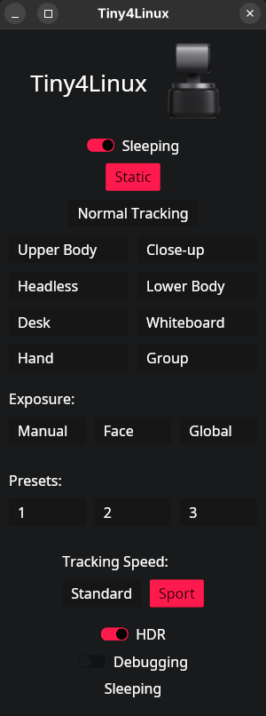

# Tiny4Linux: A GUI-Controller for the OBSBOT Tiny2

[](#installation-on-arch-linux)



Control your OBSBOT Tiny2 camera from your Linux desktop or terminal.
Set the camera to sleep, wake it up, set the AI-tracking mode, set the tracking speed, set the preset position, and more.

### Credit

This repository is a fork of [Constantine Evans's "Tiny2"](https://github.com/cgevans/tiny2),
which itself is substantially based on [samliddicott's meet4k package](https://github.com/samliddicott/meet4k).

### New features and improvements

- Toggle for **Sleep/Wake**
- Controls for the **tracking speed**
- Controls for **preset positions**
- **CLI** for camera controls (same functions as GUI)
- Updated Dependencies

#### Shortly planned features

- UI-Upgrade (WIP)
- Tests & Codecov check

### Motivation

With the Tiny series, OBSBOT offers an affordable PTZ camera option for everyone.
The OBSBOT Center provides a way to fully control these devices: https://www.obsbot.com/de/download/obsbot-tiny-2

As of [September 2025](https://web.archive.org/web/20251008100439/https://www.obsbot.com/download/obsbot-tiny-2), however, this software is only available for users on Windows and macOS.
According to [the latest Steam Hardware Survey](https://web.archive.org/web/20251008101418/https://store.steampowered.com/hwsurvey/Steam-Hardware-Software-Survey-Welcome-to-Steam), Linux users account for 2.68%, which is actually more than macOS users.
Especially within the tech community, many users (rightly so :P) rely on Linux as their operating system.
Unfortunately, they currently miss out on the configuration options offered by the OBSBOT Center.

To partially address this issue, [OBSBOT now provides an SDK](https://www.obsbot.com/de/sdk), which allows developers to replicate certain functionalities.
However, the availability of the SDK is still limited.
Fortunately, the community has since managed to implement several solutions on its own through [reverse engineering](https://github.com/taxfromdk/obsbot_tiny_reversing) and a lot of dedication.

This project provides a graphical interface for some basic features.
However, to make full use of all functions, a configuration must first be performed in the OBSBOT Center using one of the supported operating systems.
A guide on how to do this quickly and easily on Linux can be found below.

## Installation

Currently, on every release the binaries are generated and can be downloaded for manual builds.
Easier installation methods depend on the package manager of your distribution.
Currently, the following methods are supported or planned:

### Installation on Arch Linux

You can choose between the GUI-version or the CLI-version.
The GUI installs right into your desktop manager.
The CLI is installed and made available in your terminal.
Both versions are ready to use.

The GUI is available in the [Arch User Repository](https://aur.archlinux.org/packages/tiny4linux-gui/) via:
```shell
yay -S tiny4linux-gui
```

The CLI is available in the [Arch User Repository](https://aur.archlinux.org/packages/tiny4linux-cli/) via:
```shell
yay -S tiny4linux-cli
```

### Planned Installation Methods

- [Nix User Repository](https://github.com/OpenFoxes/Tiny4Linux/issues/38)
- [Flatpak](https://github.com/OpenFoxes/Tiny4Linux/issues/39)
- [Debian and RPM](https://github.com/OpenFoxes/Tiny4Linux/issues/18)

## Usage

The way you use Tiny4Linux depends on the variant you chose:

### GUI

You can start the GUI by clicking on the icon in your desktop manager or by typing `tiny4linux-gui` in your terminal.
You'll have full access to all available features in the window that opens.

### CLI

You can use the CLI by typing `t4l` or `tiny4linux-cli` in your terminal.
To get the full list of available commands, type `t4l --help` or look into the [CLI documentation](docs/cli.md).

## Setup OBSBOT Center on Linux

From my experience, it’s a good idea to have a Windows VM ready to run on Linux.
While Wine can easily run the OBSBOT Center itself, it’s unable to pass through the camera’s USB signal.
Therefore, using a VM — for example, via [VirtualBox](https://wiki.archlinux.org/title/VirtualBox) — can provide a practical workaround.

Once you’ve set the color values, gesture settings, and preset camera positions once, there’s no need to start the VM regularly anymore.
The rest is what this program is meant to handle ;)

## Run the GUI (for devs)

To run the GUI, you have to build the project and then run the binary:

```shell
cargo run --package tiny4linux --bin tiny4linux-gui
```

With *Jetbrains RustRover*, you can directly execute the corresponding Run Configuration.
